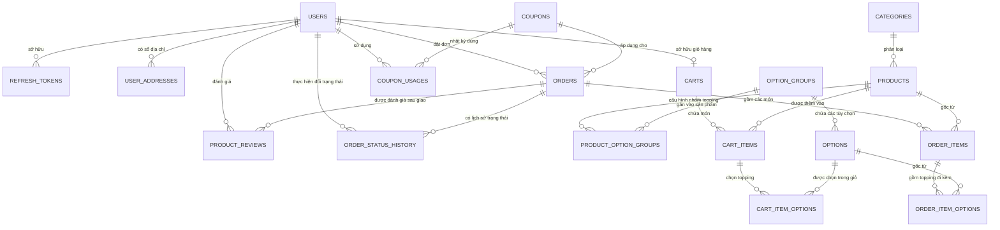

# TÀI LIỆU THIẾT KẾ CƠ SỞ DỮ LIỆU (DATABASE ARCHITECTURE & DESIGN)
**Hệ thống Quản lý Bán Bánh Mì & F&B Trực Tuyến**

---

## 1. TỔNG QUAN VỀ HỆ CƠ SỞ DỮ LIỆU

### 1.1. Công nghệ lưu trữ & ORM
- **Hệ quản trị cơ sở dữ liệu (DBMS)**: PostgreSQL (v15+)
- **Tiện ích mở rộng (Extension)**: `pgcrypto` – cung cấp hàm native `gen_random_uuid()` để sinh khóa chính ngẫu nhiên chuẩn UUIDv4.
- **Tầng truy cập dữ liệu (ORM)**: Entity Framework Core 8 (Code First / Scaffold Mapping) kết hợp **Unit of Work Pattern** (`IUnitOfWork`).
- **Chiến lược định danh (ID Strategy)**: 100% sử dụng **UUID (GUID)** cho tất cả các bảng thay vì Integer Auto-Increment truyền thống.

### 1.2. Mục tiêu kiến trúc
- **Tính toàn vẹn lịch sử (Historical Snapshotting)**: Các thông tin biến động như giá cả, tên sản phẩm, tên topping được chụp lại (snapshot) bất biến tại thời điểm đặt hàng.
- **Bảo mật & Chống rò rỉ thông tin**: Khóa chính ngẫu nhiên UUID ngăn chặn hoàn toàn việc đoán mã ID của người dùng hoặc đơn hàng (chống Enumeration Attacks / Scraping).
- **Hiệu năng cao với Index chuyên biệt**: Tối ưu hóa truy vấn cho các nghiệp vụ chính như Dashboard thống kê, danh sách đơn khách hàng, tra cứu Token, bộ lọc danh mục.

---

## 2. SƠ ĐỒ THỰC THỂ QUAN HỆ (MERMAID ERD)



---

## 3. Ý NGHĨA VÀ CHI TIẾT TỪNG CLASS (DOMAIN ENTITIES)

Hệ thống bao gồm **17 Entity Classes** được chia thành 5 phân hệ nghiệp vụ chính:

### 3.1. Phân hệ Người dùng & Xác thực (Auth & Users)

#### 1. `User` (Bảng: `users`)
- **Ý nghĩa**: Đại diện cho tài khoản người dùng trong hệ thống (bao gồm Khách hàng `CUSTOMER`, Nhân viên `STAFF`, và Quản trị viên `ADMIN`).
- **Các trường tiêu biểu**:
  - `Id` (`uuid`, PK): Mã định danh duy nhất.
  - `FullName` (`varchar(100)`): Họ tên hiển thị.
  - `PhoneNumber` (`varchar(20)`, Unique): Số điện thoại dùng làm tên đăng nhập chính và nhận thông báo đơn hàng.
  - `Email` (`varchar(255)`, Unique, Nullable): Hòm thư điện tử.
  - `PasswordHash` (`varchar(255)`): Chuỗi mật khẩu đã băm an toàn bằng thuật toán bcrypt.
  - `Role` (`varchar(20)`): Vai trò tài khoản (`CUSTOMER`, `STAFF`, `ADMIN`).
  - `IsActive` (`boolean`): Trạng thái hoạt động của tài khoản (dùng để khóa tài khoản vi phạm).
  - `IsPhoneVerified` (`boolean`): Xác thực số điện thoại qua OTP.
  - `AvatarUrl` (`text`, Nullable): Đường dẫn ảnh đại diện.
  - `CreatedAt`, `UpdatedAt` (`timestamp`): Thời điểm tạo và cập nhật gần nhất.

#### 2. `UserAddress` (Bảng: `user_addresses`)
- **Ý nghĩa**: Sổ địa chỉ giao hàng của người dùng. Một người dùng có thể lưu nhiều địa chỉ (nhà riêng, công ty) để chọn nhanh khi checkout.
- **Các trường tiêu biểu**:
  - `Id` (`uuid`, PK).
  - `UserId` (`uuid`, FK -> `users.id`): Người sở hữu địa chỉ.
  - `RecipientName` (`varchar(100)`): Tên người nhận hàng tại địa chỉ này.
  - `PhoneNumber` (`varchar(20)`): Số điện thoại liên hệ nhận hàng.
  - `StreetAddress` (`text`): Số nhà, tên đường.
  - `Ward`, `District`, `City` (`varchar(100)`): Phường/Xã, Quận/Huyện, Tỉnh/Thành phố.
  - `IsDefault` (`boolean`): Đánh dấu địa chỉ mặc định khi đặt đơn.

#### 3. `RefreshToken` (Bảng: `refresh_tokens`)
- **Ý nghĩa**: Quản lý phiên đăng nhập mở rộng (JWT Refresh Token), cho phép ứng dụng cấp mới Access Token mà không bắt người dùng phải nhập lại mật khẩu.
- **Các trường tiêu biểu**:
  - `Id` (`uuid`, PK).
  - `UserId` (`uuid`, FK -> `users.id`): Tài khoản được cấp token.
  - `Token` (`varchar(500)`, Unique): Chuỗi token mã hóa ngẫu nhiên, bảo mật.
  - `ExpiresAt` (`timestamp`): Hạn sử dụng của token.
  - `IsRevoked` (`boolean`): Cờ đánh dấu token đã bị thu hồi (khi người dùng Đăng xuất hoặc bị buộc đăng xuất từ xa).
  - `CreatedByIp` (`varchar(45)`): Địa chỉ IP đã yêu cầu đăng nhập (phục vụ bảo mật và audit).

#### 4. `Role` (Bảng: `roles`)
- **Ý nghĩa**: Định nghĩa các vai trò trong hệ thống (`ADMIN`, `STAFF`, `CUSTOMER`).
- **Các trường**:
  - `Id` (`uuid`, PK).
  - `Name` (`varchar(50)`, Unique): Tên vai trò.
  - `Description` (`text`): Mô tả vai trò.
  - `CreatedAt` (`timestamptz`).

#### 5. `UserRole` (Bảng liên kết: `user_roles`)
- **Ý nghĩa**: Bảng nối Nhiều - Nhiều giữa `User` và `Role`.
- **Khóa chính kết hợp**: `(UserId, RoleId)`.
- **Trường phụ**: `AssignedAt` (`timestamptz`).

#### 6. `Permission` (Bảng: `permissions`)
- **Ý nghĩa**: Định nghĩa quyền truy cập chi tiết và phân quyền động API (Dynamic API Permission).
- **Các trường**:
  - `Id` (`uuid`, PK).
  - `Code` (`varchar(100)`, Unique): Mã định danh quyền (vd `products.read-all`, `products.create`).
  - `Name` (`varchar(150)`): Tên hiển thị quyền.
  - `HttpMethod` (`varchar(10)`): Phương thức HTTP (`GET`, `POST`, `PUT`, `DELETE`, `*`).
  - `Url` (`varchar(255)`): Route pattern của API (vd `/api/products`, `/api/products/{id}`).
  - `Description` (`text`): Mô tả quyền.

#### 7. `RolePermission` (Bảng liên kết: `role_permissions`)
- **Ý nghĩa**: Bảng nối Nhiều - Nhiều giữa `Role` và `Permission`.
- **Khóa chính kết hợp**: `(RoleId, PermissionId)`.

---

### 3.2. Phân hệ Danh mục, Sản phẩm & Topping (Catalog & Menu)

#### 4. `Category` (Bảng: `categories`)
- **Ý nghĩa**: Nhóm danh mục món ăn (ví dụ: *Bánh Mì Truyền Thống, Bánh Mì Đặc Biệt, Nước Giải Khát, Ăn Vặt*).
- **Các trường tiêu biểu**:
  - `Id` (`uuid`, PK).
  - `Name` (`varchar(100)`): Tên danh mục.
  - `Slug` (`varchar(100)`, Unique): Chuỗi URL thân thiện với SEO (vd: `banh-mi-truyen-thong`).
  - `Description` (`text`): Mô tả danh mục.
  - `DisplayOrder` (`int`): Thứ tự sắp xếp hiển thị trên giao diện trang chủ.
  - `IsActive` (`boolean`): Cờ bật/tắt hiển thị danh mục.

#### 5. `Product` (Bảng: `products`)
- **Ý nghĩa**: Món ăn hoặc mặt hàng bán (ví dụ: *Bánh mì chả bò, Bánh mì xíu mại trứng muối*).
- **Các trường tiêu biểu**:
  - `Id` (`uuid`, PK).
  - `CategoryId` (`uuid`, FK -> `categories.id`): Thuộc danh mục nào.
  - `Name` (`varchar(255)`): Tên sản phẩm.
  - `Slug` (`varchar(255)`, Unique): Định danh URL thân thiện cho sản phẩm.
  - `Description` (`text`): Giới thiệu thành phần, hương vị món ăn.
  - `BasePrice` (`numeric(12, 2)`): Giá bán niêm yết cơ bản (chưa tính topping).
  - `ImageUrl` (`text`): Ảnh sản phẩm chất lượng cao.
  - `IsAvailable` (`boolean`): Trạng thái mở bán (hết món hoặc tạm ngừng).
  - `IsFeatured` (`boolean`): Đánh dấu món bán chạy/món đặc sản hiển thị nổi bật trên banner.
  - `StockQuantity` (`int`): Số lượng phần ăn tồn kho có thể chuẩn bị trong ngày.

#### 6. `OptionGroup` (Bảng: `option_groups`)
- **Ý nghĩa**: Nhóm các tùy chọn/topping cho món ăn (ví dụ nhóm: *Chọn độ cay*, *Thêm sốt*, *Topping thêm*, *Size ly*).
- **Các trường tiêu biểu**:
  - `Id` (`uuid`, PK).
  - `Name` (`varchar(100)`): Tên nhóm tùy chọn.
  - `SelectionType` (`varchar(20)`): Kiểu lựa chọn (`SINGLE` - chọn 1 như độ cay, hoặc `MULTIPLE` - chọn nhiều như topping).
  - `IsRequired` (`boolean`): Bắt buộc phải chọn hay không (ví dụ độ cay là bắt buộc).
  - `MinSelection`, `MaxSelection` (`int`): Giới hạn số lượng tùy chọn tối thiểu/tối đa trong nhóm.

#### 7. `ProductOptionGroup` (Bảng: `product_option_groups`)
- **Ý nghĩa**: Bảng liên kết Nhiều - Nhiều giữa `Product` và `OptionGroup`. Giúp tái sử dụng các nhóm tùy chọn (ví dụ: Nhóm "Thêm Topping" có thể gắn cho nhiều loại bánh mì khác nhau).
- **Khóa chính kết hợp**: `(ProductId, OptionGroupId)`.
- **Trường phụ**: `DisplayOrder` sắp xếp thứ tự hiển thị của nhóm tùy chọn trong trang món ăn đó.

#### 8. `Option` (Bảng: `options`)
- **Ý nghĩa**: Từng mục tùy chọn con cụ thể nằm trong `OptionGroup` (ví dụ: *Thêm Pate (+5.000đ), Thêm Trứng Ốp La (+8.000đ), Không Cay (+0đ)*).
- **Các trường tiêu biểu**:
  - `Id` (`uuid`, PK).
  - `OptionGroupId` (`uuid`, FK -> `option_groups.id`): Thuộc về nhóm tùy chọn nào.
  - `Name` (`varchar(100)`): Tên tùy chọn.
  - `PriceModifier` (`numeric(12, 2)`): Mức chênh lệch giá cộng thêm vào giá gốc.
  - `IsAvailable` (`boolean`): Tùy chọn này còn phục vụ hay tạm hết.
  - `DisplayOrder` (`int`): Thứ tự hiển thị trong nhóm.

---

### 3.3. Phân hệ Giỏ hàng (Shopping Cart)

#### 9. `Cart` (Bảng: `carts`)
- **Ý nghĩa**: Giỏ hàng trực tuyến của một người dùng đăng nhập. Mỗi người dùng chỉ có duy nhất 1 giỏ hàng (`UserId` là Unique).
- **Các trường tiêu biểu**:
  - `Id` (`uuid`, PK).
  - `UserId` (`uuid`, Unique, FK -> `users.id`): Chủ nhân giỏ hàng.
  - `UpdatedAt` (`timestamp`): Thời gian cập nhật giỏ gần nhất.

#### 10. `CartItem` (Bảng: `cart_items`)
- **Ý nghĩa**: Từng dòng món ăn nằm trong giỏ hàng.
- **Các trường tiêu biểu**:
  - `Id` (`uuid`, PK).
  - `CartId` (`uuid`, FK -> `carts.id`): Thuộc giỏ hàng nào.
  - `ProductId` (`uuid`, FK -> `products.id`): Món ăn nào được chọn.
  - `Quantity` (`int`): Số lượng đặt (mặc định 1).
  - `Note` (`text`): Ghi chú riêng cho món (ví dụ: "Ít dưa chua, nhiều ngò").

#### 11. `CartItemOption` (Bảng liên kết: `cart_item_options`)
- **Ý nghĩa**: Bảng liên kết Nhiều - Nhiều giữa `CartItem` và `Option`. Lưu lại những topping cụ thể mà khách hàng đã chọn kèm theo dòng món ăn đó trong giỏ.
- **Khóa chính kết hợp**: `(CartItemId, OptionId)`.

---

### 3.4. Phân hệ Đơn hàng & Quản lý Giao nhận (Orders & Fulfillment)

#### 12. `Order` (Bảng: `orders`)
- **Ý nghĩa**: Thực thể cốt lõi lưu trữ toàn bộ thông tin của một đơn đặt hàng.
- **Các trường tiêu biểu**:
  - `Id` (`uuid`, PK).
  - `OrderCode` (`varchar(20)`, Unique): Mã đơn thân thiện hiển thị cho khách và in bill (ví dụ: `#ORD-20260917-8821`).
  - `UserId` (`uuid`, FK -> `users.id`, Nullable): Tài khoản đặt hàng (Nullable để hỗ trợ khách vãng lai hoặc khi user bị xóa tài khoản mà không làm mất chứng từ).
  - `CustomerName`, `CustomerPhone`, `ShippingAddress` (`varchar`/`text`): Thông tin liên hệ và địa chỉ nhận bánh mì.
  - `OrderStatus` (`varchar(30)`): Trạng thái tiến trình (`PENDING`, `PROCESSING`, `SHIPPED`, `COMPLETED`, `CANCELLED`).
  - `PaymentStatus` (`varchar(30)`): Trạng thái thanh toán (`UNPAID`, `PAID`, `FAILED`).
  - `PaymentMethod` (`varchar(30)`): Phương thức thanh toán (`CASH` - tiền mặt COD, `BANK_TRANSFER` - chuyển khoản ngân hàng/VietQR).
  - `Subtotal` (`numeric(12, 2)`): Tổng tiền món trước giảm giá.
  - `ShippingFee` (`numeric(12, 2)`): Phí giao hàng.
  - `DiscountAmount` (`numeric(12, 2)`): Số tiền được giảm từ mã khuyến mãi.
  - `TotalAmount` (`numeric(12, 2)`): Tổng tiền thực thu cuối cùng sau cùng = `Subtotal + ShippingFee - DiscountAmount`.
  - `CouponId` (`uuid`, FK -> `coupons.id`, Nullable): Mã voucher áp dụng cho đơn.
  - `Note` (`text`): Ghi chú giao hàng tổng thể.
  - `CreatedAt`, `UpdatedAt` (`timestamp`).

#### 13. `OrderItem` (Bảng: `order_items`)
- **Ý nghĩa**: Chi tiết từng món ăn trong đơn hàng đã chốt.
- **Đặc tính Snapshot quan trọng**:
  - `ProductName` (`varchar(255)`): **Sao chép tên món tại lúc đặt**. Dù sau này Admin có đổi tên món trong bảng `products` thì hóa đơn cũ vẫn giữ nguyên tên lúc khách mua.
  - `UnitPrice` (`numeric(12, 2)`): **Sao chép đơn giá món tại lúc đặt**. Nếu sản phẩm tăng hay giảm giá sau đó, giá trị hóa đơn cũ tuyệt đối không bị thay đổi.
  - `Quantity` (`int`): Số lượng món đã mua.
  - `ItemTotalPrice` (`numeric(12, 2)`): Tổng tiền dòng này = `(UnitPrice + Tổng Topping) * Quantity`.
  - `ItemNote` (`text`): Ghi chú cách làm của khách cho món này.
  - `ProductId` (`uuid`, FK -> `products.id`, OnDelete `SetNull`).

#### 14. `OrderItemOption` (Bảng: `order_item_options`)
- **Ý nghĩa**: Chi tiết từng topping/tùy chọn đi kèm theo món ăn trong đơn hàng đã chốt.
- **Đặc tính Snapshot**:
  - `OptionName` (`varchar(100)`): Lưu trực tiếp tên topping lúc mua.
  - `OptionPrice` (`numeric(12, 2)`): Lưu giá tiền của topping tại thời điểm mua.
  - `OrderItemId` (`uuid`, FK -> `order_items.id`).
  - `OptionId` (`uuid`, FK -> `options.id`, OnDelete `SetNull`).

#### 15. `OrderStatusHistory` (Bảng: `order_status_history`)
- **Ý nghĩa**: Nhật ký kiểm toán (Audit Trail) lịch sử thay đổi trạng thái đơn hàng. Giúp truy vết minh bạch: Ai đã đổi trạng thái (Admin/Staff nào), từ trạng thái gì sang trạng thái gì, vào lúc nào và có ghi chú lý do gì.
- **Các trường tiêu biểu**:
  - `Id` (`uuid`, PK).
  - `OrderId` (`uuid`, FK -> `orders.id`): Đơn hàng được cập nhật.
  - `PreviousStatus` (`varchar(30)`): Trạng thái cũ trước khi đổi.
  - `NewStatus` (`varchar(30)`): Trạng thái mới sau khi đổi.
  - `ChangedByUserId` (`uuid`, FK -> `users.id`, Nullable): Nhân viên hoặc khách hàng thao tác.
  - `Note` (`text`): Lý do thay đổi (ví dụ: "Khách gọi xin hủy vì có việc bận", "Shipper giao thành công").
  - `CreatedAt` (`timestamp`): Thời điểm đổi trạng thái.

---

### 3.5. Phân hệ Khuyến mãi & Đánh giá (Marketing & Reviews)

#### 16. `Coupon` (Bảng: `coupons`)
- **Ý nghĩa**: Quản lý các voucher khuyến mãi, mã giảm giá kích cầu mua sắm.
- **Các trường tiêu biểu**:
  - `Id` (`uuid`, PK).
  - `Code` (`varchar(50)`, Unique): Mã code nhập vào (vd: `BANHMINGON`, `FREESHIP`).
  - `DiscountType` (`varchar(20)`): Loại giảm (`PERCENTAGE` - giảm theo %, hoặc `FIXED_AMOUNT` - giảm số tiền cố định).
  - `DiscountValue` (`numeric(12, 2)`): Giá trị giảm (vd: `20` cho 20% hoặc `30000` cho 30.000đ).
  - `MinOrderAmount` (`numeric(12, 2)`): Giá trị đơn hàng tối thiểu để được áp dụng.
  - `MaxDiscountAmount` (`numeric(12, 2)`, Nullable): Mức giảm trần tối đa khi giảm theo %.
  - `UsageLimit` (`int`, Nullable): Tổng số lượt mã có thể sử dụng trên toàn hệ thống.
  - `UsedCount` (`int`): Số lượt đã sử dụng thực tế tính đến hiện tại.
  - `StartDate`, `EndDate` (`timestamp`): Hiệu lực bắt đầu và kết thúc của mã.
  - `IsActive` (`boolean`): Cờ bật/tắt kích hoạt mã.

#### 17. `CouponUsage` (Bảng: `coupon_usages`)
- **Ý nghĩa**: Bảng nhật ký ghi lại từng lần một khách hàng sử dụng mã giảm giá. Chống gian lận sử dụng mã lặp lại nếu mã đó quy định "1 khách chỉ dùng 1 lần".
- **Khóa ngoại**: `CouponId` (FK -> `coupons.id`), `UserId` (FK -> `users.id`).
- **Trường phụ**: `UsedAt` (`timestamp`).

#### 18. `ProductReview` (Bảng: `product_reviews`)
- **Ý nghĩa**: Đánh giá sao (rating) và nhận xét của khách hàng về món ăn sau khi đơn hàng đã hoàn tất.
- **Các trường tiêu biểu**:
  - `Id` (`uuid`, PK).
  - `ProductId` (`uuid`, FK -> `products.id`): Món ăn được đánh giá.
  - `UserId` (`uuid`, FK -> `users.id`): Người gửi đánh giá.
  - `OrderId` (`uuid`, FK -> `orders.id`, Nullable): Gắn liền với đơn mua thực tế (xác thực Verified Purchase).
  - `Rating` (`int`): Điểm đánh giá (1 đến 5 sao).
  - `Comment` (`text`): Lời nhận xét về chất lượng món ăn và dịch vụ.
  - `CreatedAt` (`timestamp`).

---

## 4. PHÂN TÍCH CHI TIẾT MỐI QUAN HỆ GIỮA CÁC CLASS

### 4.1. Mối quan hệ 1 - 1 (One-to-One)
- **`User` <--> `Cart`**:
  - Mỗi User khi đăng ký tài khoản chỉ sở hữu duy nhất một giỏ hàng mua sắm cá nhân.
  - Ràng buộc: `carts.user_id` có chỉ mục **UNIQUE**. Khi truy vấn lấy giỏ hàng của khách, truy vấn chỉ trả về đúng 1 bản ghi duy nhất.

### 4.2. Mối quan hệ 1 - Nhiều (One-to-Many)
- **`Category` <--> `Product`**: Một danh mục (vd: *Bánh mì*) chứa nhiều sản phẩm. Một sản phẩm chỉ thuộc về một danh mục duy nhất.
- **`User` <--> `UserAddress`**: Một người dùng có thể lưu nhiều địa chỉ nhận hàng trong sổ địa chỉ.
- **`User` <--> `Order`**: Một người dùng có thể đặt nhiều đơn hàng trong lịch sử mua sắm.
- **`Order` <--> `OrderItem`**: Một đơn hàng bao gồm nhiều dòng món ăn được đặt.
- **`OrderItem` <--> `OrderItemOption`**: Một món ăn trong đơn có thể kèm theo nhiều tùy chọn/topping khác nhau.
- **`OptionGroup` <--> `Option`**: Một nhóm tùy chọn (vd: *Độ cay*) sở hữu nhiều tùy chọn con (*Không cay, Cay vừa, Rất cay*).
- **`Order` <--> `OrderStatusHistory`**: Một đơn hàng ghi nhận nhiều mốc lịch sử thay đổi trạng thái theo thời gian.
- **`User` <--> `RefreshToken`**: Một tài khoản có thể đăng nhập trên nhiều thiết bị (điện thoại, laptop) nên có thể sở hữu nhiều Refresh Token còn hiệu lực.

### 4.3. Mối quan hệ Nhiều - Nhiều (Many-to-Many) & Bảng trung gian
1. **`Product` <--> `OptionGroup` (thông qua bảng `product_option_groups`)**:
   - Cho phép 1 sản phẩm có nhiều nhóm tùy chọn (vd: Bánh mì chả lụa có cả nhóm "Độ cay" và nhóm "Topping thêm").
   - Đồng thời, 1 nhóm tùy chọn có thể tái sử dụng cho hàng chục sản phẩm khác nhau mà không phải tạo lại dữ liệu trùng lặp.
2. **`CartItem` <--> `Option` (thông qua bảng `cart_item_options`)**:
   - Khi món ăn nằm trong giỏ, khách có thể chọn nhiều topping đi kèm.
3. **`User` <--> `Coupon` (thông qua bảng `coupon_usages`)**:
   - Quan hệ giữa người dùng và mã giảm giá để kiểm soát tần suất áp dụng voucher.

### 4.4. Chiến lược Toàn vẹn Tham chiếu (Delete Behaviors)
Database được thiết lập các cơ chế bảo toàn dữ liệu nghiêm ngặt:
- **`DeleteBehavior.Restrict`**:
  - Không cho phép xóa `Category` nếu vẫn còn `Product` thuộc danh mục đó.
  - Không cho phép xóa `Coupon` nếu đã có lịch sử `CouponUsage`.
- **`DeleteBehavior.SetNull`**:
  - Khi xóa `User` (ví dụ tài khoản bị xóa vì chính sách bảo vệ dữ liệu), trường `UserId` trong `orders` được chuyển thành `NULL`. **Hóa đơn và doanh thu trong quá khứ không bao giờ bị xóa theo**, đảm bảo tính chính xác cho kế toán doanh nghiệp!
  - Khi một `Product` bị xóa khỏi hệ thống, các dòng `order_items` cũ vẫn tồn tại nguyên vẹn nhờ thông tin snapshot tên và giá.
- **`DeleteBehavior.Cascade`**:
  - Khi xóa giỏ hàng `Cart` hoặc món trong giỏ `CartItem`, các tùy chọn liên quan trong giỏ sẽ được tự động dọn dẹp sạch sẽ.

---

## 5. NHỮNG ƯU ĐIỂM VƯỢT TRỘI ĐÃ TÍCH HỢP VÀO DATABASE

Hệ thống cơ sở dữ liệu của dự án được thiết kế đạt tiêu chuẩn **Production-Ready Enterprise**, tích hợp các kỹ thuật kiến trúc phần mềm tiên tiến:

### 1. 🛡️ Sử dụng UUIDv4 và Tiện ích mở rộng PostgreSQL `pgcrypto`
- Thay vì sử dụng số nguyên tuần tự (`1, 2, 3...`), hệ thống sử dụng UUID ngẫu nhiên do `gen_random_uuid()` của PostgreSQL sinh ra.
- **Ưu điểm**:
  - Ngăn chặn triệt để hình thức tấn công **Enumeration Attack** (kẻ xấu không thể đoán được URL đơn hàng của người khác dạng `/orders/1`, `/orders/2`).
  - Hạn chế lộ số lượng đơn hàng và quy mô kinh doanh thực tế của quán.
  - Giúp việc chia tách (sharding), đồng bộ dữ liệu giữa nhiều cơ sở dữ liệu phân tán không bao giờ bị xung đột khóa chính.

### 2. 📸 Kỹ thuật Historical Snapshotting (Bất biến Dữ liệu Tài chính)
- Trong các hệ thống kém chất lượng, `OrderItem` chỉ lưu `ProductId` và tham chiếu giá từ bảng `Product`. Khi cửa hàng tăng giá từ 25.000đ lên 35.000đ, báo cáo doanh thu của năm trước bị biến động sai lệch hoàn toàn.
- **Giải pháp của dự án**:
  - Bảng `order_items` và `order_item_options` lưu trữ trực tiếp `ProductName`, `UnitPrice`, `OptionName`, `OptionPrice` tại thời điểm bấm Đặt hàng.
  - Bảo đảm nguyên tắc kế toán: **Hóa đơn đã xuất là tài liệu bất biến theo thời gian**.

### 3. ⚡ Hệ thống Đánh Chỉ Mục (Indexing) Tối Ưu Tốc Độ Cao
Hệ thống được thiết kế các chỉ mục chuyên sâu phục vụ các câu truy vấn phức tạp:
- **`idx_orders_dashboard`** trên `(created_at, order_status, total_amount)`: Tối ưu hóa truy vấn tính tổng doanh thu và vẽ biểu đồ dashboard nhanh chóng dù có hàng triệu đơn hàng.
- **`idx_orders_user`** trên `(user_id, created_at DESC)`: Giúp màn hình "Lịch sử đơn hàng của tôi" hiển thị tức thì với chi phí index scan tối thiểu.
- **`idx_refresh_tokens_lookup` (Filtered / Partial Index)**:
  - Cú pháp: `CREATE INDEX idx_refresh_tokens_lookup ON refresh_tokens(user_id, token) WHERE is_revoked IS FALSE;`
  - Chỉ đánh index trên những token **chưa bị thu hồi**. Giúp tốc độ xác thực JWT cực nhanh và tiết kiệm dung lượng RAM máy chủ DB.
- **Unique Indexes**: Đặt trên `phone_number`, `email`, `slug`, `order_code`, `coupon.code` đảm bảo tính duy nhất và tăng tốc tra cứu `O(1)`.

### 4. 🔒 Ràng buộc Kiểm tra Tầng Cơ Sở Dữ Liệu (Check Constraints)
- Đảm bảo tính nhất quán ngay tại tầng thấp nhất mà không chỉ phụ thuộc vào tầng mã ứng dụng:
  ```csharp
  entity.ToTable("orders", t => t.HasCheckConstraint(
      "orders_payment_method_check",
      "payment_method IN ('CASH', 'BANK_TRANSFER')"));
  ```
- Ngăn chặn hoàn toàn việc dữ liệu không hợp lệ lọt vào cơ sở dữ liệu.

### 5. 📜 Hệ thống Kiểm toán Minh bạch (Audit Trail)
- Với bảng `order_status_history`, cửa hàng có thể biết chính xác tiến trình xử lý đơn hàng, minh bạch trách nhiệm giữa nhân viên thu ngân, nhân viên làm bếp và shipper.

### 6. 🎟️ Kiểm soát Khuyến mãi Đa tầng (Anti-Fraud Coupons)
- Kết hợp đồng thời 2 lớp bảo vệ:
  - Cấp độ mã: `UsageLimit` (tổng số người được dùng) vs `UsedCount` (đã dùng bao nhiêu).
  - Cấp độ cá nhân: Bảng `coupon_usages` lưu dấu vết ai đã dùng mã nào để ngăn ngừa việc 1 tài khoản tạo nhiều đơn áp mã giảm giá vượt quy định.

### 7. 🔄 Giao dịch Nguyên tử (ACID Transaction) & Hoàn Kho Tự Động
- Toàn bộ thao tác cập nhật đơn hàng và hoàn trả tồn kho đều được bọc trong giao dịch `ExecuteInTransactionAsync` của `IUnitOfWork`.
- Khi đơn hàng chuyển sang trạng thái `CANCELLED`, hàm `RestoreStockAsync` sẽ tự động cộng lại đúng số lượng món ăn vào kho hàng `products.stock_quantity`. Nếu có bất kỳ sự cố mạng nào xảy ra giữa chừng, giao dịch sẽ tự động Rollback, bảo đảm không bao giờ bị lệch dữ liệu kho.

---

*Tài liệu được biên soạn đồng bộ với kiến trúc dự án MyProjectHiNet (Clean Architecture + CQRS + PostgreSQL).*
