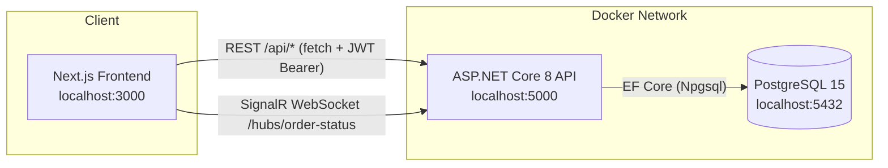
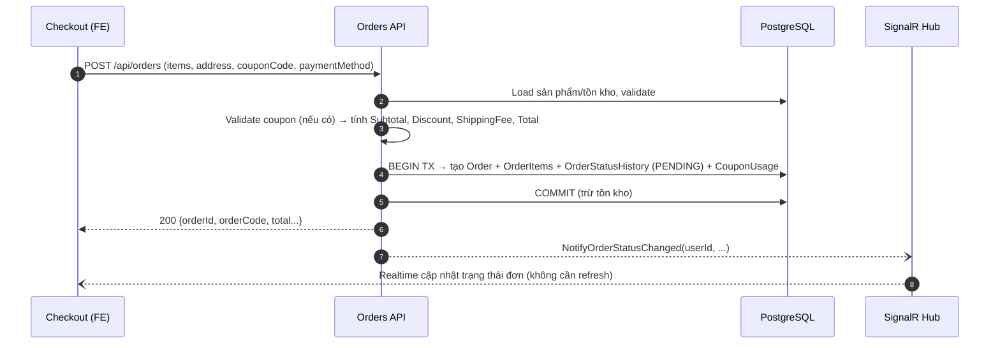
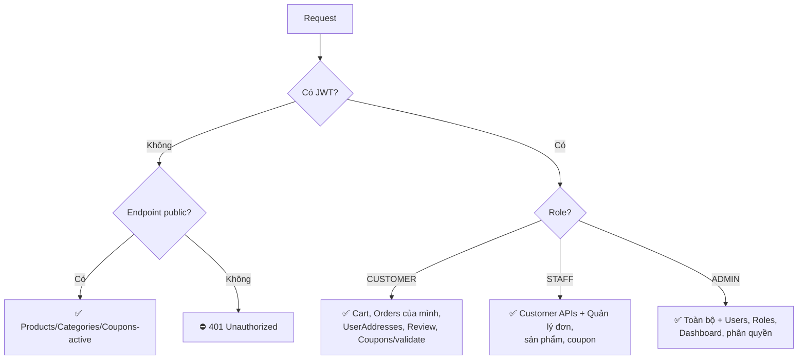
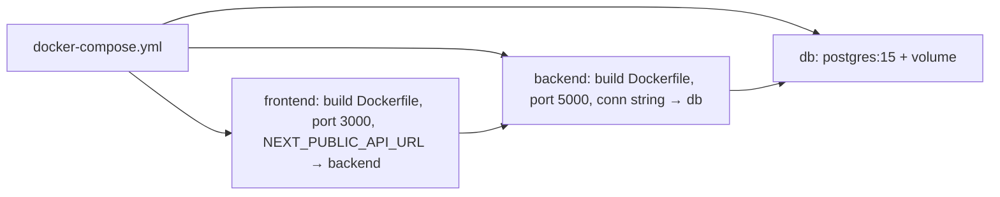

# 📋 Tóm tắt nghiệp vụ & Phân luồng Project — ProductManagement (HiNet)

> Cập nhật: 2026-09-22
> Stack: **Backend** ASP.NET Core 8 (Clean Architecture: WebAPI / Application / Domain / Infrastructure, PostgreSQL, EF Core, JWT, SignalR) — **Frontend** Next.js (App Router, TypeScript, TailwindCSS) — **DB** PostgreSQL 15 — **Deploy** Docker Compose.

---

## 1. Sơ đồ kiến trúc tổng thể



- **api-client.ts**: wrapper `fetch` tự gắn `Authorization: Bearer <token>`, tự refresh token khi 401.
- **CORS** cho phép origin FE; **JWT** xác thực + **DynamicPermissionMiddleware** phân quyền theo role/permission.

---

## 2. Phân luồng nghiệp vụ chính

### 2.1. Xác thực (Auth)
- **Đăng ký** → OTP gửi về SĐT/email → **verify OTP** → kích hoạt user.
- **Đăng nhập** → Access token (JWT ~15') + Refresh token (lưu bảng `RefreshTokens`, có revoke/rotate).
- Roles: `ADMIN`, `STAFF`, `CUSTOMER`. Phân quyền API bằng `[Authorize]` + `RolePermissions` (dynamic).
- FE lưu token, interceptor tự refresh; guard route theo role.

### 2.2. Danh mục & Sản phẩm (public, không cần đăng nhập)
- `GET /api/categories`, `GET /api/products` (+ filter/search/paging) — mở cho khách vãng lai.
- Sản phẩm có `OptionGroup` / `Option` (size, màu...), giá và tồn kho theo biến thể.
- Quản lý (CRUD) chỉ ADMIN/STAFF.

### 2.3. Giỏ hàng (Cart)
- Khách **phải đăng nhập** để dùng giỏ hàng lưu server (`Carts`, `CartItems`).
- Thêm/sửa/xoá item, kèm option; số lượng giới hạn theo tồn kho.

### 2.4. Mã giảm giá (Coupon) — luồng quan trọng ⭐
- **Hiển thị trên homepage: KHÔNG cần đăng nhập** — `GET /api/coupons/active` (anonymous) trả về các mã đang hoạt động.
- **Áp dụng mã khi thanh toán: bắt buộc đăng nhập** — validate qua `POST /api/coupons/validate` và được tính lại trong `POST /api/orders`.
- Trạng thái hiển thị: `SẮP DIỄN RA` (now < StartDate) / `ĐANG HOẠT ĐỘNG` / `ĐÃ KẾT THÚC` — FE tính theo **giờ local**, BE so sánh theo **UTC**, FE gửi ISO UTC lên BE.

```mermaid
flowchart TD
    A[Trang chủ - khách chưa đăng nhập] --> B[GET /api/coupons/active<br/>anonymous]
    B --> C{BE kiểm tra}
    C -->|IsActive & now∈[Start,End]| D[Hiển thị coupon card]
    C -->|ngoài giờ| E[Không hiển thị]
    D --> F{Khách bấm dùng}
    F -->|chưa đăng nhập| G[Redirect /login]
    F -->|đã đăng nhập| H[Trang checkout]
    H --> I[POST /api/coupons/validate<br/>code + subtotal]
    I -->|hợp lệ| J[Áp dụng giảm giá vào tổng tiền]
    I -->|không hợp lệ| K[Hiện lỗi: hết hạn/hết lượt/đơn tối thiểu]
```

Quy tắc validate (BE `CouponService`):
1. Mã tồn tại + `IsActive = true`
2. `StartDate ≤ now ≤ EndDate` (UTC)
3. `MinOrderAmount ≤ subtotal`
4. `UsageLimit` chưa vượt (`UsedCount < UsageLimit`) và user chưa dùng quá lượt cho phép (bảng `CouponUsages`)
5. Giảm: `FIXED_AMOUNT` (trừ trực tiếp, có thể cap bởi `MaxDiscountAmount`) hoặc `PERCENTAGE` (theo %, cap bởi `MaxDiscountAmount`); discount không vượt subtotal.
6. Khi tạo đơn thành công: tăng `UsedCount`, ghi `CouponUsage`.

### 2.5. Thanh toán / Tạo đơn (Checkout) ⭐


- `PaymentMethod`: `COD` | `BANK_TRANSFER` (khớp constraint `orders_payment_method_check` trong DB).
- `PaymentStatus`: `UNPAID` → `PAID` (staff/admin xác nhận).
- Lỗi đã fix: inject thiếu `ICouponRepository` trong `CreateOrderHandler`, value `paymentMethod` không hợp lệ.

### 2.6. Vòng đời đơn hàng & Trạng thái (tiếng Việt)
```
PENDING (Chờ xác nhận)
  → CONFIRMED (Đã xác nhận)
  → PREPARING? / SHIPPING (Đang giao hàng)
  → COMPLETED (Hoàn thành)
  ↘ CANCELLED (Đã huỷ) — mọi bước trước COMPLETED
```
- **STAFF/ADMIN** cập nhật trạng thái: `PUT /api/orders/{id}/status` — cho phép **mọi chuyển trạng thái hợp lệ** (đã fix: trước đây chỉ COMPLETED).
- Ghi lịch vào `OrderStatusHistory` (ai đổi, khi nào, ghi chú).
- Mỗi lần đổi trạng thái → **SignalR phát sự kiện** tới đúng user → FE tự cập nhật trạng thái + list lọc theo status (`Đơn hàng của tôi` nhảy đúng tab filter) **không cần F5**.
- FE hiển thị nhãn tiếng Việt; order có SignalR fail sẽ fallback polling.

### 2.7. SignalR Realtime
- Hub: `/hubs/order-status`, group theo `userId` (JWT validate qua query string `access_token`).
- FE: hook `useOrderStatusHub` — kết nối với token, nghe event `OrderStatusChanged`, reconnect tự động.
- Lỗi 401/negotiate đã xử lý: gửi token qua `accessTokenFactory` + backend cho phép token từ query string.

### 2.8. Địa chỉ giao hàng (UserAddresses)
- CRUD: `GET/POST/PUT/DELETE /api/user-addresses` — **một controller duy nhất, không lặp API** (đã kiểm tra BE + FE service chỉ gọi endpoint này).
- Mỗi user nhiều địa chỉ, có flag `isDefault`; trang checkout **mặc định chọn sẵn địa chỉ mặc định** (nếu có).

### 2.9. Đánh giá sản phẩm (ProductReview)
- Chỉ khách đã mua (đơn COMPLETED) mới được đánh giá; staff/admin quản lý hiển thị.

### 2.10. Admin/Staff
- `AdminController`: dashboard thống kê (doanh thu, đơn theo trạng thái, top sản phẩm).
- Quản lý coupon (CRUD + bật/tắt), đơn hàng, sản phẩm, danh mục, users.

---

## 3. Sơ đồ phân luồng quyền truy cập API



---

## 4. Timezone — quy ước chuẩn (đã thống nhất fix)
| Tầng | Quy ước |
|---|---|
| FE hiển thị | `DateTime` UTC từ BE → convert sang **giờ local (GMT+7)** hiển thị |
| FE gửi lên BE | `new Date(local).toISOString()` → **ISO UTC** |
| BE lưu | Lưu **UTC** (`DateTime.SpecifyKind(..., Utc)`) |
| BE so sánh | `DateTime.UtcNow` với StartDate/EndDate lưu UTC |

→ Coupon `SALE10K` (14:52 +0700) lưu dưới DB là UTC, BE so `UtcNow` ⇒ hiển thị đúng "ĐANG HOẠT ĐỘNG" đúng giờ VN.

---

## 5. Docker Deployment



Lệnh chạy:
```powershell
docker-compose up -d --build
```
- Lưu ý: chạy local bằng `dotnet run` khi port 5000 đã bị process cũ chiếm → kill process hoặc đổi port (lỗi `AddressInUseException` đã gặp).

---

## 6. Checklist các lỗi đã fix
- [x] UserAddresses API không còn lặp/thừa (1 controller, 1 service FE).
- [x] Coupon homepage hiển thị cho khách chưa đăng nhập (`/api/coupons/active` anonymous).
- [x] Timezone coupon FE/BE (hiển thị + gửi + validate đúng giờ).
- [x] Validate coupon khi bấm "Áp dụng" + re-validate khi subtotal đổi.
- [x] Lỗi 500 khi tạo đơn (inject `ICouponRepository`, `paymentMethod` hợp lệ DB constraint).
- [x] Cập nhật trạng thái đơn: mọi trạng thái hợp lệ (không chỉ COMPLETED).
- [x] Nhãn trạng thái tiếng Việt + filter "Đơn hàng của tôi" nhảy đúng tab.
- [x] SignalR realtime cho customer (token từ query string, tự reconnect, không cần F5).
- [x] Checkout chọn sẵn địa chỉ mặc định.
- [x] Backend build Release: 0 lỗi; FE typecheck: 0 lỗi.
- [x] Docker hoá BE + FE + DB (docker-compose).
